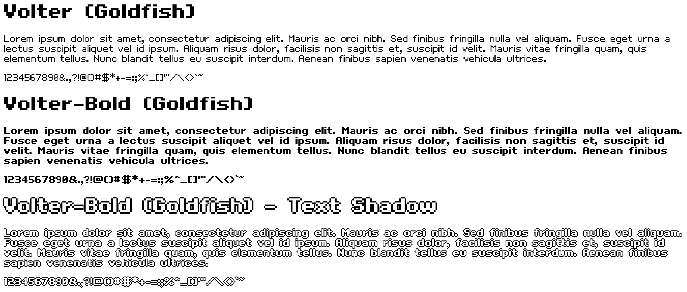

# Goldfish

In this repository are the fonts `Volter (Goldfish)` and `Volter-Bold (Goldfish)`, which are pixel-style `sans-serif` fonts.

Volter (Goldfish) and Volter-Bold (Goldfish) are font faces created by [Sulake](http://www.sulake.com/).

---



## Setup

To set up the font faces:

- Make sure the font files are in the correct directory
- Copy the `volter` and `volter-bold` directories, along with `goldfish.css`, to your application
- Import the `goldfish.css` file in any CSS file you wish to use it in

  ```scss
  @import url("path/to/goldfish.css");
  ```

Then you can start using the font faces:

```scss
@import url("goldfish.css");

// Volter Goldfish
h1 {
  font-family: 'Volter Goldfish';
}

// Volter-Bold Goldfish
h1 {
  font-family: 'Volter Goldfish';
  font-weight: bold;
}
```

**Demo webpages for the fonts can be found in each of their respective directories**