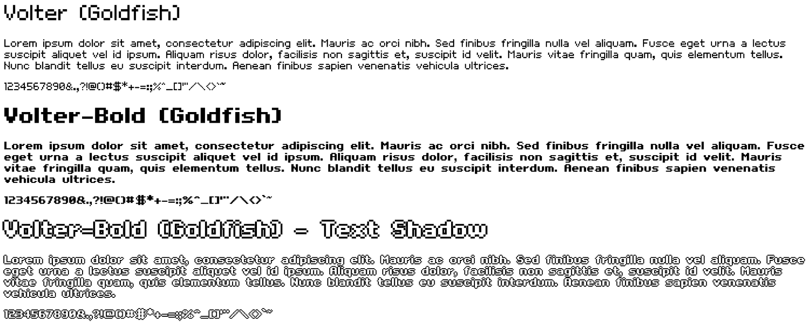

# Goldfish

The Volter (Goldfish) font and its bold variation, Volter-Bold, both pixel-style sans-serif fonts created by [Sulake](http://www.sulake.com/).

---



## Setup

To set up the font faces:

- Copy the `volter` directory into your project.
- Import `volter/volter.css` in any CSS file you wish to use it in.

Then you can start using the font faces, e.g.:

```scss
@import url("volter/volter.css");

// Volter (Goldfish)
span.volter {
  font-family: 'Volter';
}

// Volter-Bold (Goldfish)
span.volter-bold {
  font-family: 'Volter';
  font-weight: bold;
}
```

## Disclaimer

```
Copyright, trademarks and other rights in the material from Habbo Hotel® and other services of Sulake Group in this repository are owned by Sulake Group.
This repository is neither owned nor operated by Sulake Group and it is not part of Habbo Hotel®.
Habbo®, Habbo Hotel®, Sulake and associated logos are trademarks of Sulake Group. All rights reserved.
```
